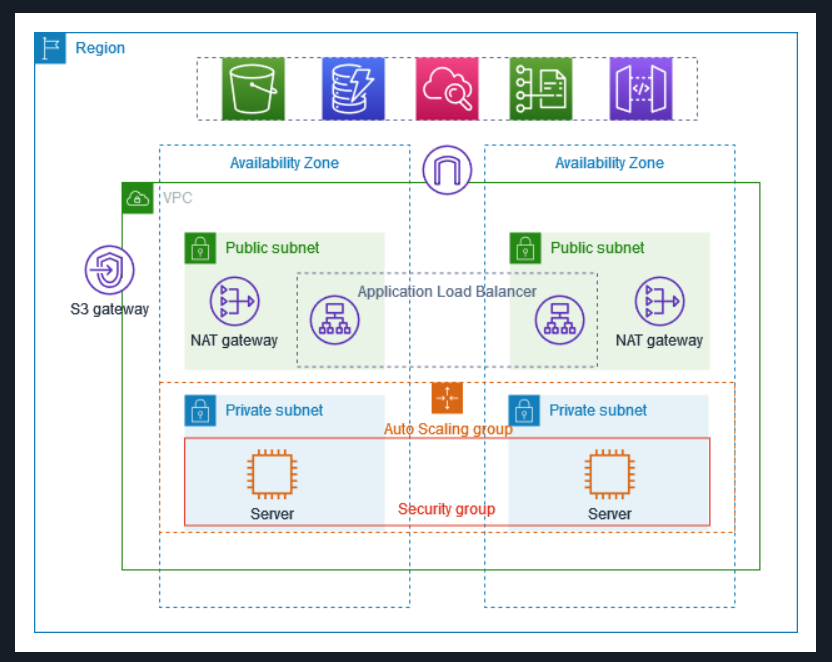

# **Understanding VPC End to End**

### **When we hear VPC (Virtual Private Cloud), a few things come to mind right away:**

#### 1. **Isolated Network Environment:**
    It’s like having your own private data center inside a cloud provider (AWS, GCP, Azure, etc.), fully under your control.
#### 2. **Customizable Networking:**
    We define IP address ranges, subnets, route tables, and gateways.
#### 3. **Security:**
    We can use security groups, NACLs (Network Access Control Lists), and private/public subnets to control traffic.
#### 4. **Connectivity:**
    You can connect your VPC to on-premises via VPN or Direct Connect/ExpressRoute and to the internet via an Internet Gateway or NAT Gateway.
#### 5. **Multi-tier Architecture:**
    Tpical use case is splitting infrastructure into public subnets (e.g., load balancers, bastion hosts) and private subnets (e.g., databases, application servers).
#### 6. **In-short:**
    A VPC is your own logically isolated cloud network where you can run resources (EC2, databases, containers, etc.) with full control over networking and security.

### **Reference Diagram**

### **Components of VPC**
- Internet Gateway (IGW)
- Subnets (Public and Private)
    - A Subnet is called public subnet only if it is associated with IGW i.e, Internet
- LoadBalancer 
- NAT 
- Security group (statefull)
- NACLs (stateless)